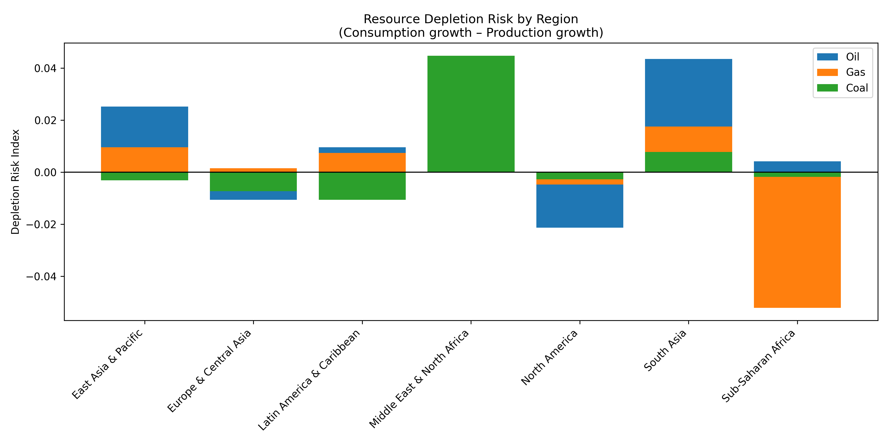

# Energy sustainability and depletion risk forecast

This section analyzes the dynamics of the global energy sector through the lens of **CAGR** (compound annual growth rate) for the period **1990–2022.** ## Methodology: Depletion Risk Index (DRI)

To assess the sustainability of regions, we use the **Depletion Risk Index**, which is calculated using the following formula:

$$DRI = CAGR_{Consumption} - CAGR_{Production}$$

* **DRI > 0:** Consumption is growing faster than production. The region is increasing its dependence on imports and rapidly depleting its domestic reserves.
* **DRI < 0:** Production is outpacing consumption. The region is strengthening its position as a global exporter.

---

## 1. Regional risk analysis

Data analysis has revealed a critical imbalance in developing economies: rapid industrial growth in these countries is not supported by adequate expansion of their own raw material base.

### Key risk areas (Top 10 by DRI):
1.  **Middle East and North Africa (Coal):** Highest risk (**0.044**). With coal consumption growing at **3.5%** per year, domestic production is falling by **0.9%**. This signals a radical change in the energy paradigm in the region.
2.  **South Asia (Oil & Gas):** Critical zone. Oil consumption is growing by **4.2%** annually, while production is stagnating or falling (**-0.07%**). This puts enormous pressure on government budgets due to import costs.
3.  **East Asia and the Pacific:** Despite its status as a major producer, the growth rate of gas (5.9%) and oil (2.7%) consumption consistently outpaces the rate of development of new fields.

---

## 2. Analysis by resource type

### Oil — “Scarce resource”
Oil shows a positive risk index in almost all developing regions. We are seeing a global trend: old fields are reaching a plateau, while demand in Asia and Latin America continues to grow exponentially.

### Natural gas — “Transitional fuel”
South and East Asia are experiencing extreme growth rates in consumption (up to **6%** per year). Domestic production is not keeping pace with this rally, making these regions the main drivers of the global LNG market.

### Coal — “Regional Polarization”
In India (South Asia), the risk index remains positive (**0.007**). Even with record domestic production volumes, the country is forced to increase imports to ensure the energy security of its power plants.

---

## 3. Conclusions on energy security

* **South Asia — “red zone”:** The region ranks in the top 10 in terms of risk (for all types of fuel) three times. This makes it the most vulnerable to global price shocks.
* **Logistical fragility:** The widespread growth of DRI for oil means that the global economy is becoming critically dependent on the stability of sea lanes and the tanker fleet.
* **Economic incentive for renewable energy:** High depletion rates in Asia are not only an environmental argument, but also a powerful economic argument for a rapid transition to renewable energy in order to reduce dependence on raw materials.
---

## Final conclusion on global resource depletion

Based on the multidimensional analysis conducted, a fundamental conclusion can be drawn: **the global energy system is in a phase of “transitional fragility.”** 

The main risk lies not in the physical disappearance of fossil fuels, but in the **mathematical impossibility** of maintaining current consumption growth rates through traditional extraction in the long term (until 2050). Regions with an accumulated deficit (DRI > 0.02) will be the first to face the need for a complete structural restructuring of their economies. The only path to long-term sustainability is a radical increase in energy efficiency and the replacement of scarce hydrocarbons with local generation.
