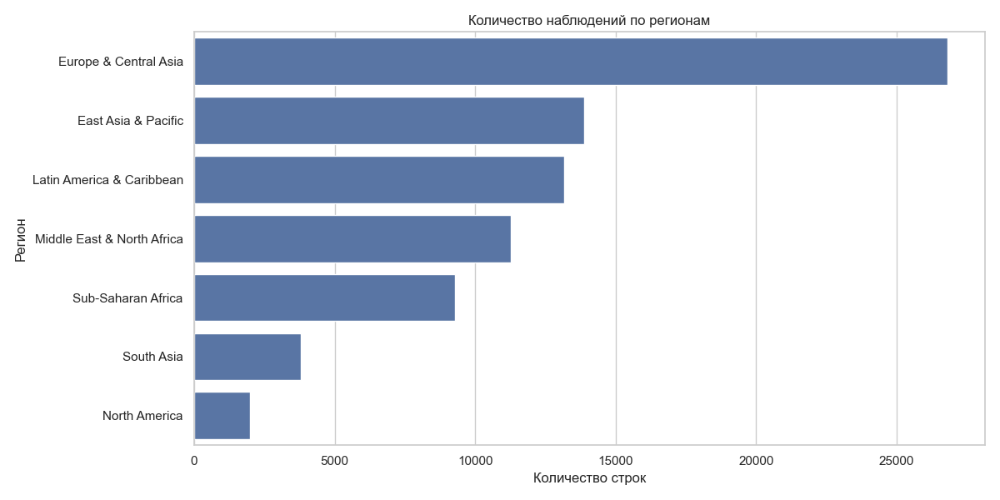
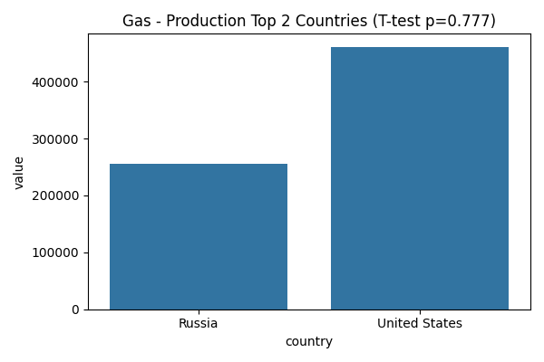

# Final Analytical Report: Global Energy Consumption Trends (1900–2024)

## 1. Executive Summary (Key Insights)
* **Shift in global leadership:** Over the past 30 years, the center of gravity of global energy consumption has shifted definitively from the Atlantic region (Europe, US) to the Asia-Pacific region (China, India).
* **Energy parity:** Statistical analysis has confirmed that there is no significant difference in gas production volumes between Russia and the US (p=0.777), making them equal architects of the gas market.
* **Critical risk zones:** South Asia is the most vulnerable region in terms of energy security, with consumption growth rates far outpacing domestic production capacity (DRI for oil and gas > 4%).
* **Clustering of forces:** The world is clearly divided into five energy camps, with the “Giant Cluster” (China, US) consuming more than all other clusters combined.

---

## 2. Data Structure Overview (EDA)

The dataset contains **80,639 observations** covering the period from 1900 to 2024. 

* **Metric imbalance:** Production data is 10 times more extensive than emissions data, which requires caution in environmental modeling.
* **Regional coverage:** Europe leads in terms of the number of historical records, but Asia dominates in terms of absolute values in the 21st century.

---

## 3. Statistical testing of hypotheses

We tested key assumptions about differences between regions and leading countries.

| Hypothesis | Result (p-value) | Conclusion |
| :--- | :--- | :--- |
| **Equality of regions (ANOVA)** | 0.000 | **Rejected**. Geography determines energy levels. |
| **Gas production parity (USA vs Russia)** | **0.777** | **Confirmed**. Production volumes are statistically indistinguishable. |
| **Oil leadership (USA vs Saudi Arabia)** | 0.0007 | **Significant**. The US and Saudi Arabia have different production profiles. |
| **Coal gap (China vs USA)** | 0.054 | **On the verge**. Historically comparable, but China is pulling ahead. |

---

## 4. Multivariate analysis and segmentation (PCA + KMeans)

The use of the principal component analysis method revealed the hidden structure of the global energy balance.

* **Cluster 1 (Superpowers):** The US and China. Unique economies with enormous scale across all metrics.
* **Cluster 2 (Exporters):** Russia, Saudi Arabia, Canada. Shift towards production.
* **Clusters 3-5:** Developing countries and small economies heavily dependent on global resource prices.

---

## 5. Risk Forecast and Energy Security

We calculated the **Depletion Risk Index (DRI)** as the difference between consumption and production growth rates ($CAGR_{Cons} - CAGR_{Prod}$).

* **Critical shortage:** In South Asia, the risk for oil is **0.043**. This means an annual increase in the gap between supply and demand of 4.3%.
* **Coal trap:** The Middle East (MENA) has the highest risk for coal (0.044), which is associated with the depletion of local resources while industry remains dependent on coal.

---

## 6. Final recommendations

1.  **For business:** Investors should redirect capital to gas storage and transportation infrastructure in Asia, as consumption rates there (CAGR ~6%) guarantee stable long-term demand.
2.  **For the public sector:** South Asian countries need urgent diversification (transition to renewable energy sources), as the current DRI for fossil fuels will lead to inevitable budget crises.
