# Report on testing statistical hypotheses in the energy sector

This section presents the results of testing hypotheses about differences in resource production, consumption, and emissions between regions and key countries.

---

## 1. Regional differences (ANOVA)
For each resource, the null hypothesis was tested: *“The average values of the indicator are the same for all geographic regions.”* In all cases, the **p-value = 0.000**, which allows us to reject the null hypothesis.

### Natural gas (Gas)
* **Consumption:** The **North America** region stands out with the highest median consumption and a significant number of large consumers (emissions on the graph).
* **Production:** The situation is similar to consumption — North America leads by a wide margin, confirming its status as the largest producer and consumer of gas.

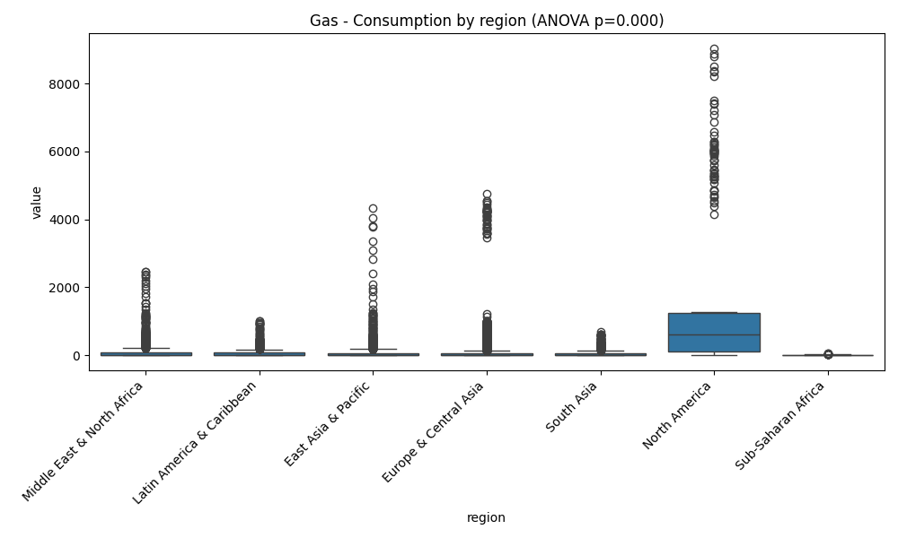
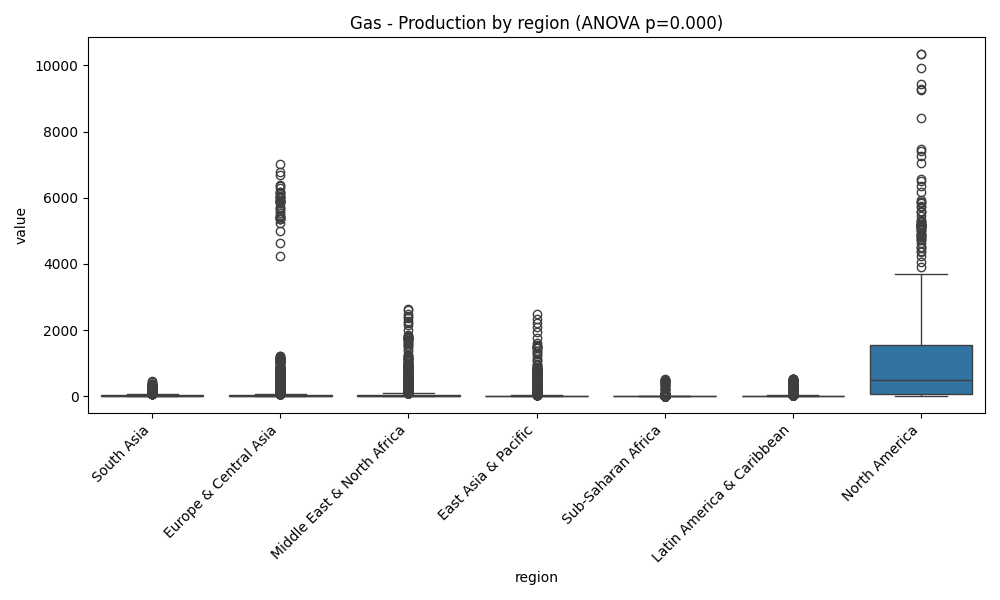

### Coal (Coal)
* **Consumption and production:** The graphs clearly show the anomalous gap in the **East Asia & Pacific** region. The huge number of outliers in this region indicates that there are countries within it (probably China) whose scale of activity exceeds the global average by tens of times.

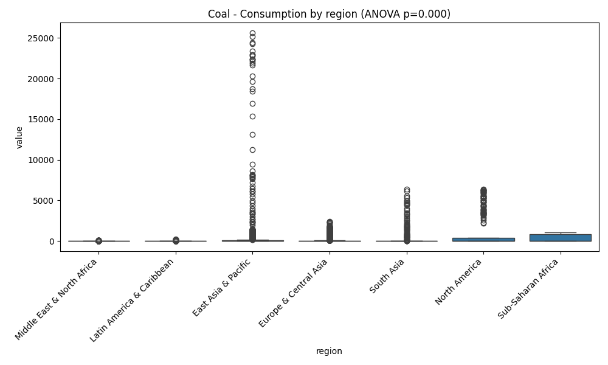
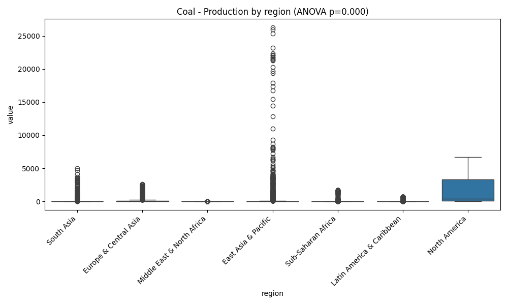

### CO2 emissions
* The main concentration of emissions is recorded in **East Asia & Pacific** and **North America**. At the same time, the most extreme point values are observed in Asia.

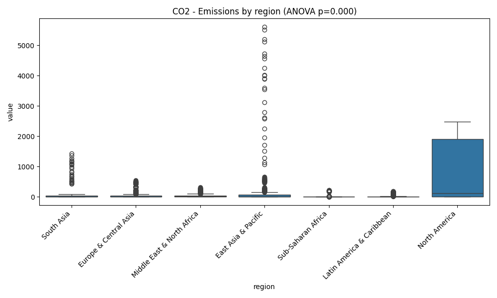

---

## 2. Comparison of market leaders (T-tests)
We compared the two largest countries in each category to see if the gap between them was statistically significant.

### Coal industry (China vs. USA)
* **Production:** The difference between China and the USA is on the verge of statistical significance (p=0.054). This suggests that, historically, their production volumes have been comparable, although China is in the lead.
* **Consumption:** Here, the gap is critical (**p=0.000**). China consumes coal in volumes that exceed those of the US many times over.

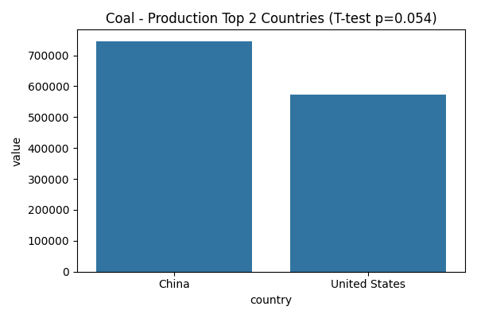
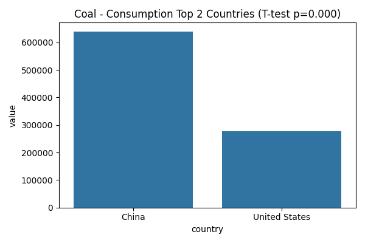

### Gas industry (Russia vs USA)
* **Production:** The T-test showed **p=0.777**. This is a crucial insight: there is no statistically significant difference in gas production volumes between Russia and the USA over the entire observation period. They are equal giants in the market.
* **Consumption:** Despite similar production levels, the USA consumes significantly more gas than Russia (**p=0.000**).

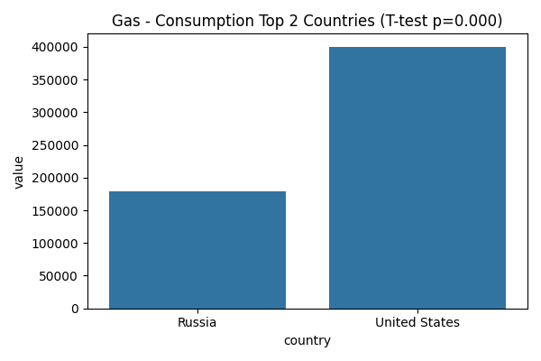

### Emissions (China vs USA)
* China significantly exceeds the USA in total CO2 emissions (**p=0.000**), which directly correlates with abnormally high coal consumption in this region.

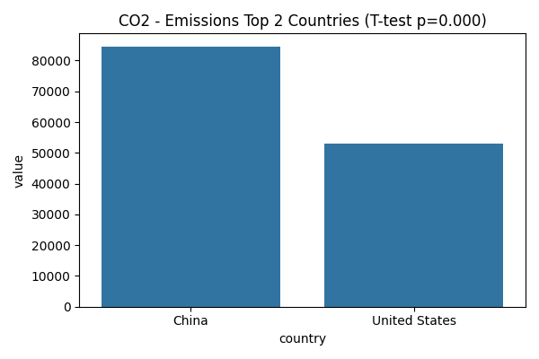

---

## 3. Oil industry

### Regional differences (ANOVA)
As with other resources, the regional factor plays a decisive role (**p-value = 0.000**). 
* **Consumption:** North America and Europe show the highest and most stable figures, while the Asia-Pacific region has the highest number of extreme values (emissions).
* **Production:** This is where the highest data variability is observed. The Middle East and North America are key centers of power in terms of production volumes.

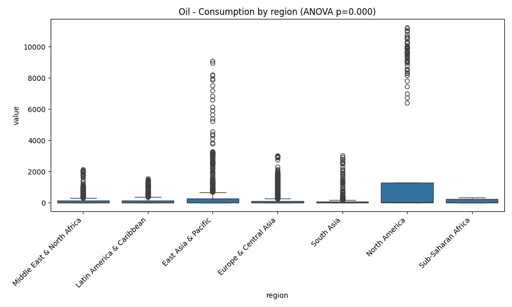
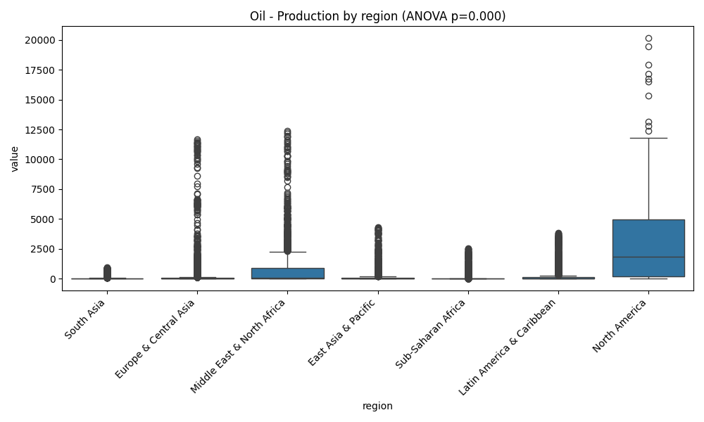

### Comparison of leaders (T-tests)
* **Oil Production (USA vs Saudi Arabia):** The difference in production volumes between the USA and Saudi Arabia is statistically significant (**p = 0.0007**). Despite the leadership of both countries, their production profiles differ significantly in the long term.
* **Oil Consumption (USA vs China):** The US remains a larger consumer of oil than China in historical terms, and this difference is statistically confirmed (**p = 0.000**).

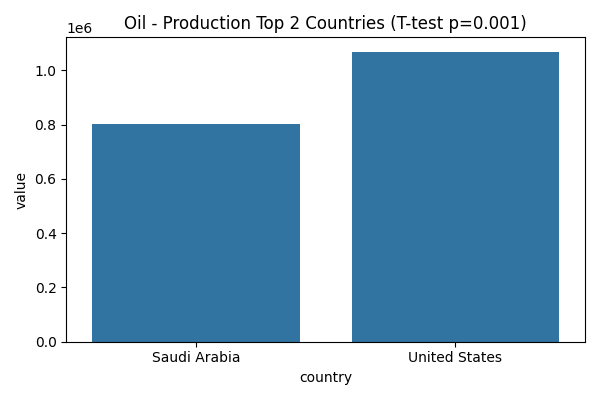
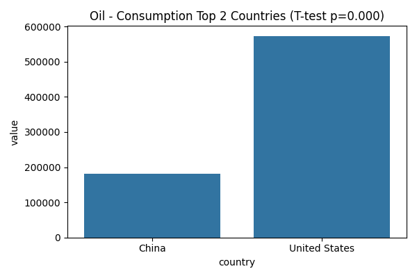

---

## 4. Summary table of test results

The table below shows the key metrics for all tests. Recall that at $\alpha = 0.05$, the result is considered significant if $p < 0.05$.

| Resource | Metric | Test type | p-value | Significant? |
| :--- | :--- | :--- | :--- | :--- |
| **Oil** | Consumption | ANOVA (Regions) | 0.000 | **Yes** |
| **Oil** | Consumption | T-test (USA vs China) | 0.000 | **Yes** |
| **Oil** | Production | T-test (USA vs Saudi Arabia) | 0.0007 | **Yes** |
| **Gas** | Production | T-test (USA vs Russia) | **0.777** | **No** |
| **Coal** | Production | T-test (China vs USA) | 0.054 | **No** (borderline) |
| **CO2** | Emissions | ANOVA (Regions) | 0.000 | **Yes** |

Final conclusion on the hypotheses

1.  **Geographical determinism:** For all types of resources and metrics (production, consumption, emissions), the region is a critical factor. The hypothesis of regional equality is rejected in all cases.
2.  **The only exception (Gas Production):** The only test that did not show significant differences was the comparison of gas production in the US and Russia. This confirms their status as two comparable global leaders in the gas industry in terms of capacity.
3.  **Coal uncertainty:** The difference in coal production between China and the US is not statistically significant at the 5% level (p=0.054), indicating historical competition between these countries in the extraction of this resource until China's sharp breakaway in recent decades.
