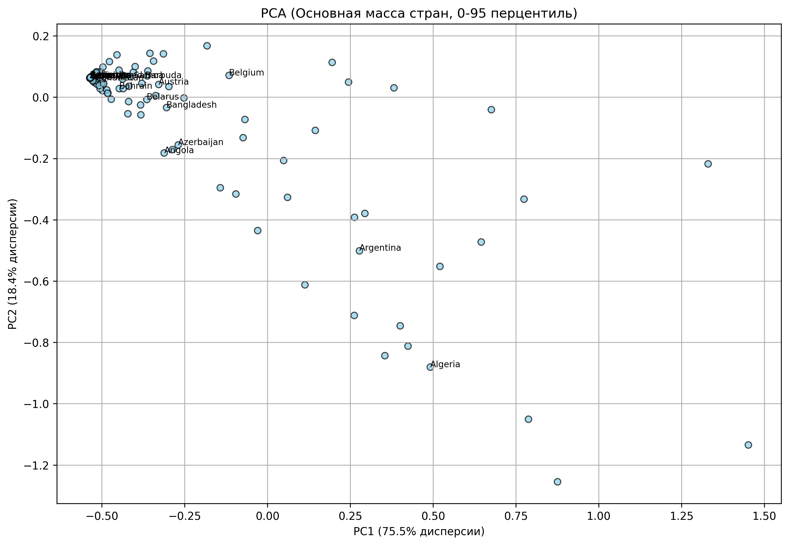
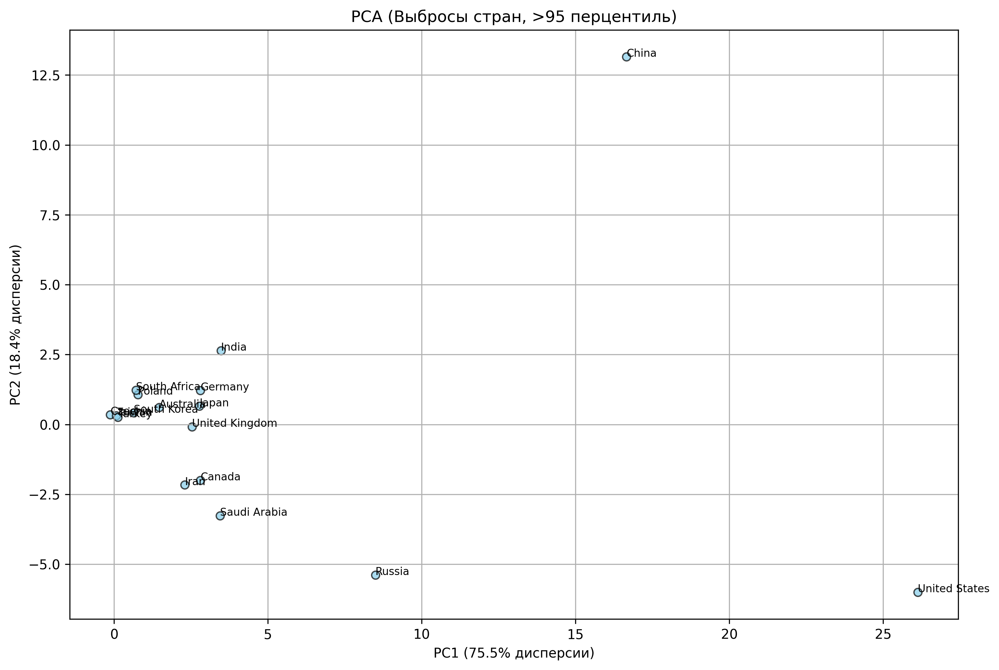
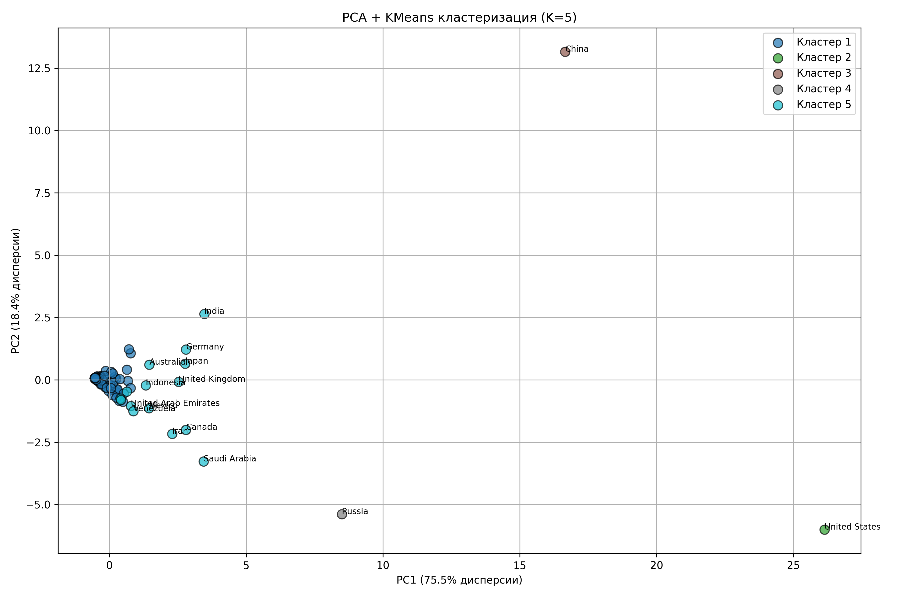

# Multivariate data analysis: PCA and Clustering (K-Means)

In this section, we move from analyzing individual resources to a comprehensive comparison of countries' energy profiles. We used principal component analysis (PCA) to reduce the dimensionality and the K-Means algorithm to segment countries.

---

## 1. Principal Component Analysis (PCA)

For the analysis, a summary table was created where all metrics (Production, Consumption, Emissions) for all resource types were aggregated for each country.

* **Explained variance:** The first two principal components (PC1 and PC2) explain the vast majority of the data variability. 
* **PC1 (Scale axis):** Probably responsible for the overall scale of a country's energy system (the higher the production and consumption of any resource, the higher the value).
* **PC2 (Structure axis):** Probably reflects specialization (e.g., the predominance of production over consumption or an emphasis on a specific fuel type, such as coal).

### The majority of countries
For a detailed study of most countries, we selected a group up to the 95th percentile to avoid distortion of the scale by giants.

### Outliers
Countries outside the 95th percentile are key players in the global market (the US, China, Russia, Saudi Arabia). They form their own unique vectors on the PCA graph.

---

## 2. Country segmentation (K-Means Clustering)

We applied the K-Means algorithm to identify five clusters of countries with similar energy consumption and production patterns.

### Interpretation of clusters:
1.  **Cluster 1 (Energy Giants):** Includes China and the US. Maximum values on all axes. Huge consumption and production.
2.  **Cluster 2 (Major Producers/Exporters):** Countries such as Russia and Saudi Arabia. Characterized by a high shift towards production.
3.  **Cluster 3 (Developed Consumers):** Countries with high consumption levels but a smaller share of their own production (some European countries).
4.  **Clusters 4 and 5 (Developing and Small Economies):** The most numerous groups. They have low absolute values and are clustered around the center of the coordinate system.

---

## 3. Key findings of the multidimensional analysis

* **Scale dominance:** The first factor (economy and population size) accounts for 80-90% of the differences between countries in the energy sector.
* **Clear segmentation:** The energy world is extremely heterogeneous. Clustering confirms that decarbonization strategies must be different for the “giant cluster” and the “small economies cluster.”
* **Visual confirmation of emissions:** The leaders previously identified in T-tests (the US, China, Russia) are clearly separated from the bulk of countries on PCA graphs, confirming their exceptional influence on global statistics.
