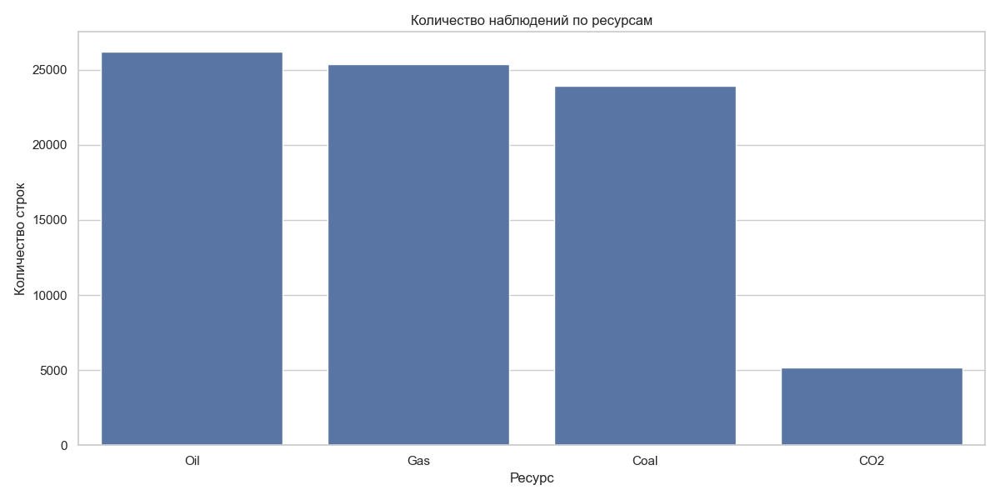
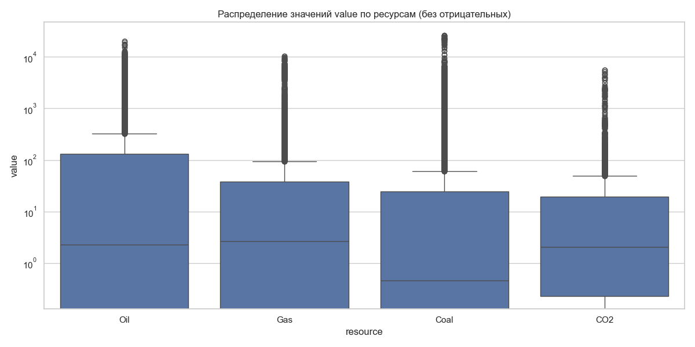
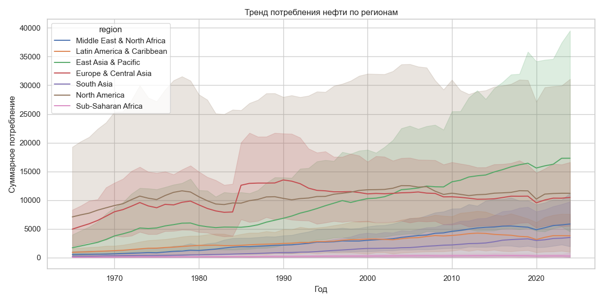

# Аналитический отчет по визуализации данных энергопотребления

## 1. Количественный обзор данных (EDA)

На текущем этапе анализа данных проведена оценка распределения наблюдений по ключевым категориям: ресурсам, метрикам и регионам. 

* **Ресурсы и метрики:** Основной массив данных сосредоточен на ископаемом топливе (**Oil, Gas, Coal**). Метрика **Production** (добыча) превалирует в датасете, составляя более 59% всех записей. Данные по выбросам (**Emissions**) составляют лишь 6%, что является «узким местом» для экологического анализа.

* **География:** Наибольшая плотность данных характерна для региона **Europe & Central Asia** (более 26 тыс. строк), в то время как **North America** представлена минимально (около 2 тыс. строк), что обусловлено малым количеством стран в составе региона.

---

## 2. Анализ распределения значений (Value)

Для понимания масштабов потребления и добычи был использован метод «ящика с усами» (boxplot) с логарифмической шкалой.

* **Дисперсия:** Среднее значение показателя составляет **198.54**, однако стандартное отклонение превышает **925**, что указывает на экстремальную разницу между странами-лидерами и остальным миром.
* **Выбросы:** Огромное количество точек за пределами «усов» (в районе $10^4$) подтверждает, что мировая энергетика сильно центрирована вокруг нескольких крупнейших игроков.

---

## 3. Исторические тренды: Потребление нефти (1965–2024)

Анализ временных рядов суммарного потребления нефти позволяет выделить ключевые геополитические и экономические сдвиги:

1. **Смена лидерства:** Регион **East Asia & Pacific** демонстрирует агрессивный рост с 2000-х годов, выходя на первое место в мире.
2. **Энергоэффективность Запада:** **North America** и **Europe** показывают стагнацию или снижение потребления, что может быть связано с переходом на возобновляемые источники и повышением КПД производств.
3. **Кризис 2020 года:** На графике отчетливо виден резкий «провал» потребления во всех регионах, вызванный пандемией COVID-19, с последующим восстановлением.

